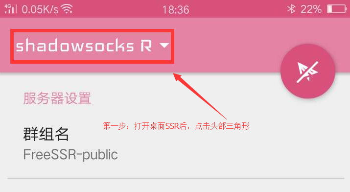
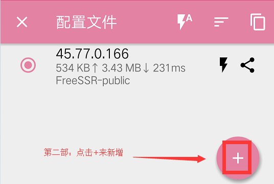
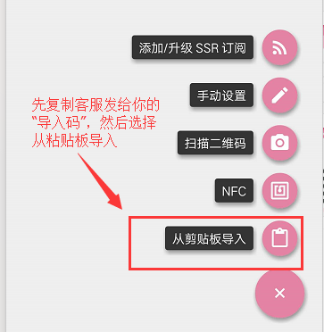
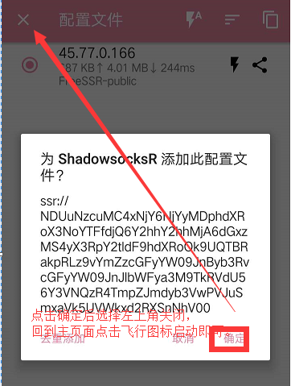
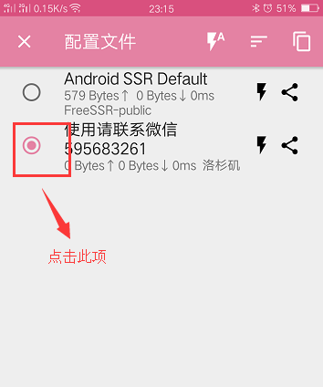
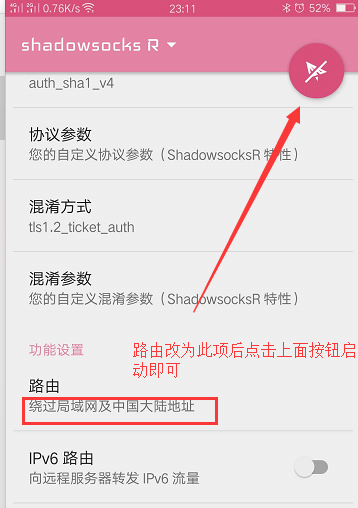

[点击下载使用](http://47.105.159.148/res/shadowsocksr-android-3.5.4.apk)(勿在微信中点入，请复制到浏览器打开)

[备用链接](/shadowsocksr-android-3.5.4.apk)

请花一分钟看一下下面教程，之后打开ssr App，选择从粘贴板导入方式添加。

软件绿色无病毒，请放心安装使用

### 1. 第一步：下载并安装

请点击上面链接下载后安装。安装完成后，找到SSR的图标（一个粉色纸飞机的图标，名称为 SSR）并点击运行。

### 2.第二步：添加代理服务配置

打开ssr客户端后，出现如下配置界面。

### 第三步：录入代理参数

使用 【从剪切板导入】 来操作。

剪切板导入。 将客服发给你的导入码（找客服要），复制粘贴进来，点击确定,最后点击飞机图标或电图标开启

------

