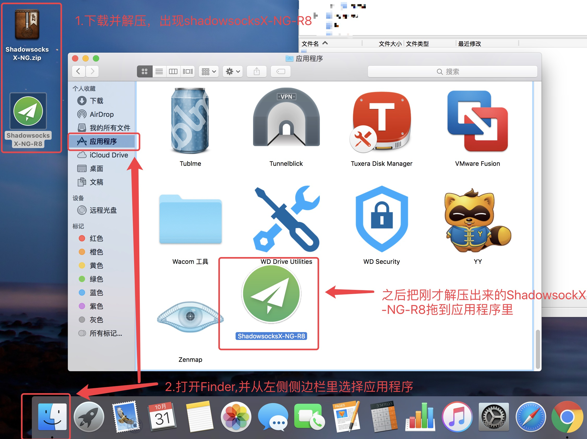
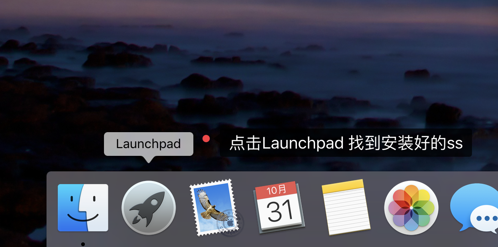
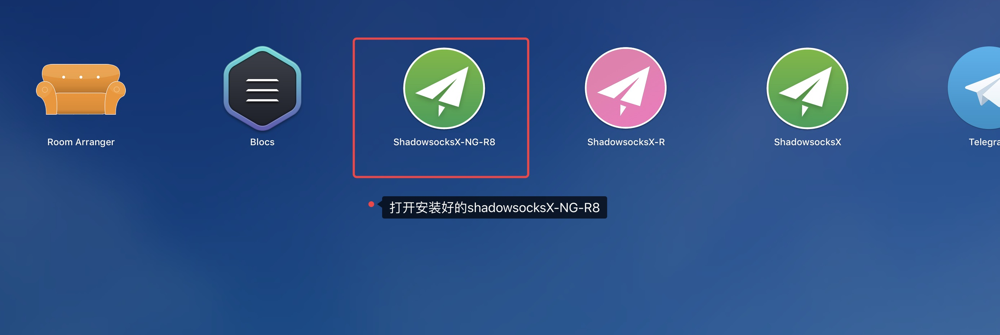
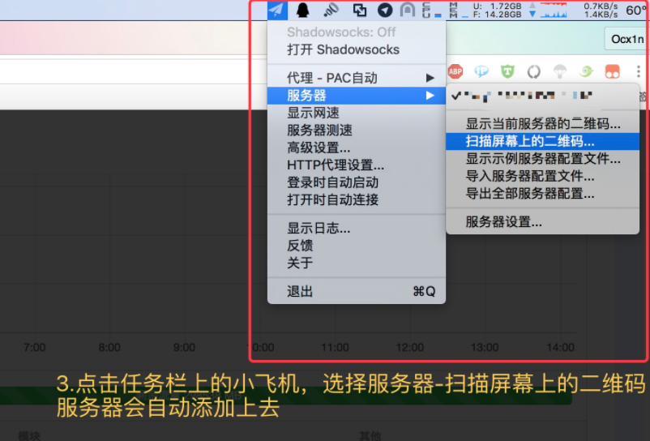
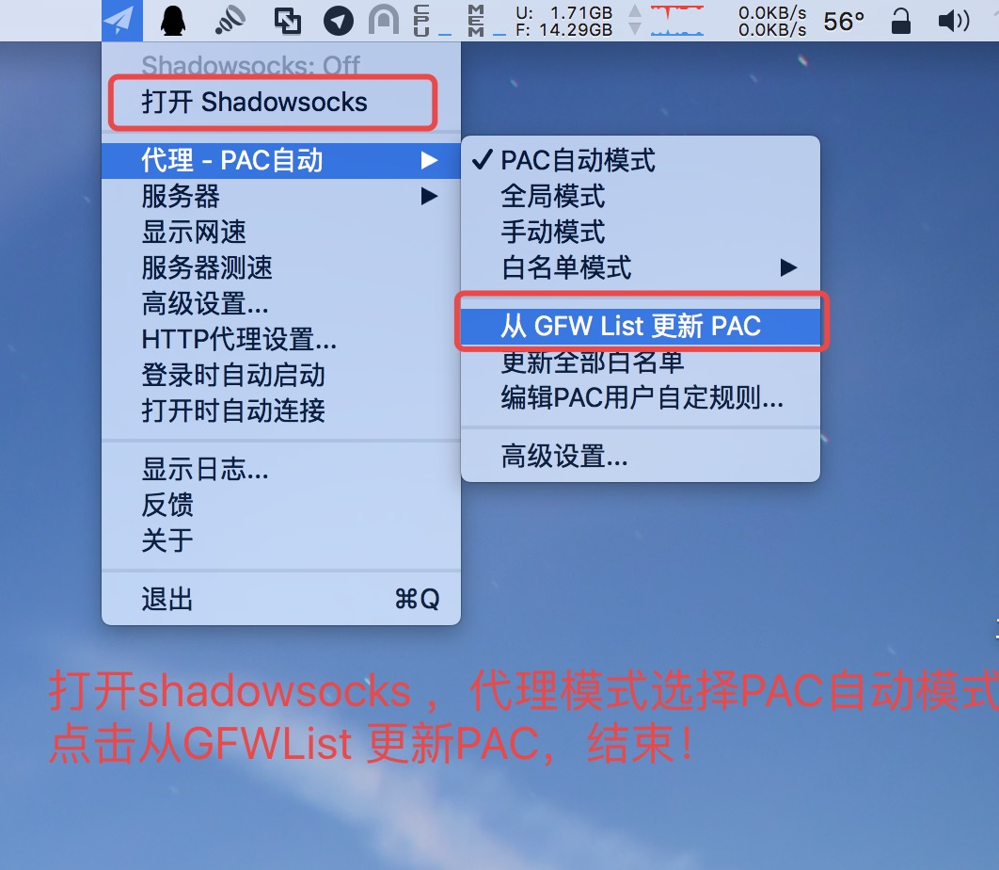

[点击下载使用](http://47.105.159.148/res/ShadowsocksX-NG-R8.dmg)

[备用链接](/ShadowsocksX-NG-R8.dmg)

请花一分钟看一下下面教程。
软件绿色无病毒，请放心安装使用

### 1. 安装$$客户端

### 2. 打开安装好的$$客户端

### 第三步：添加服务器参数

点击 客户端里的 扫描屏幕二维码 ，扫描上面的节点二维码 ,二维码找客服要

### 第四步： 打开代理开关，设置完成。

注：第一次使用，请更新一下PAC，点击：从GFWList 更新 PAC

