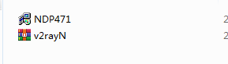
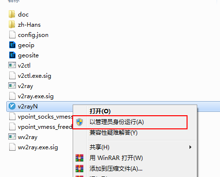
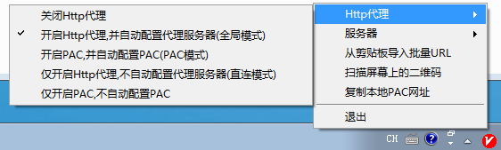
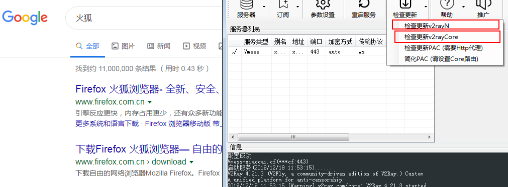

[点击打包下载解压按说明使用](/SY2V.zip)

- ​	单独下载: [v2rayN](/v2rayN.rar) 

- ​	单独下载: [NDP471](/NDP471.exe) , 也可以去百度搜索 net framework 4.71 下载,这里提供微软的下载地址: https://www.microsoft.com/en-us/download/details.aspx?id=56116

	

# 使用说明

### 1.压缩包解压后，可以看到如下两个文件

### 2. 先安装NDP471,

	直接一路next即可（备注： 如果您的电脑已经有该软件了，则不需要安装）。

### 3. 再解压v2rayN，解压后进入该文件夹，如图步骤进行

### 4. 完成以上步骤即可上网

注意：

- 先测试能不能上网（google 或youtube）；
- 如果能则不需要进行一下步骤。
- 如果不能上网， 则进行更新软件。

